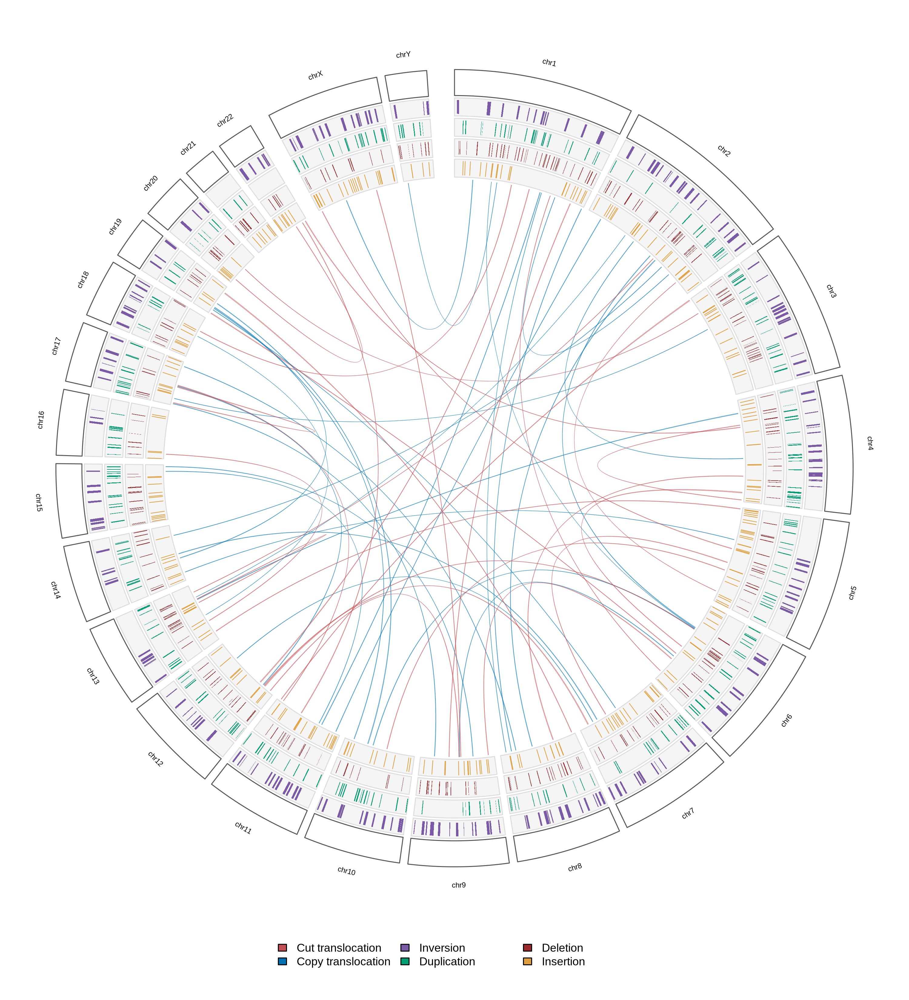

## fig1 



simulation performed on the full human genome. Download it with:
```bash
wget -c https://hgdownload.soe.ucsc.edu/goldenPath/hg38/bigZips/latest/hg38.fa.gz
gunzip hg38.fa.gz
```

the configfile is provided in the relative figure folder

```bash
pixi run inSVert simulate fig1-circos/config.yaml data/Homo_sapiens.GRCh38.dna.primary_assembly.fa --seed 123 -o fig1-circos/simulated.vcf

pixi run Rscript scripts/plot_circlize.R fig1-circos/simulated.vcf data/Homo_sapiens.GRCh38.dna.primary_assembly.fa.fai fig1-circos/fig1 --format png
```
